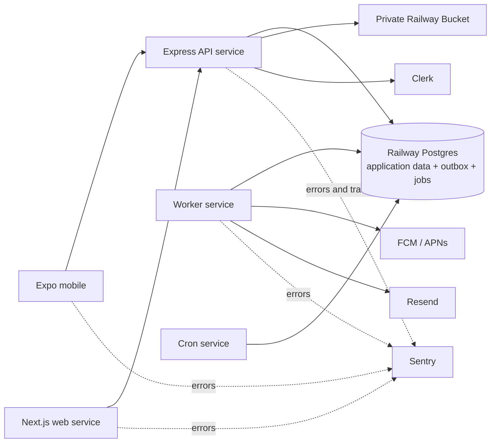

# PuckFlow MVP Product and Technical Plan

**Version:** 2.0
**Status:** Approved design
**Last revised:** July 13, 2026
**Scope:** Team-first MVP; league operations and payments are deferred

---

## 1. Executive summary

PuckFlow is a hockey-first, team-first product for organizing rosters, games,
attendance, results, and player scoring details. A team must receive full value
without a league adopting the product.

The MVP deliberately optimizes for what a self-organized hockey team does every
week:

1. Maintain a roster that includes players who may never create an account.
2. Schedule games and collect simple attendance responses.
3. Record the result after the game.
4. Optionally attribute known goals and assists.
5. See a team record and clearly qualified player statistics.

The backend runs on Railway. Railway hosts the web application, API, worker,
scheduled job runner, Postgres database, and private object storage. Clerk,
Firebase/APNs, Resend, Sentry, and Expo Application Services remain external,
purpose-built services.

The MVP does not include live scoring, offline synchronization, leagues, shared
cross-team games, public profiles, payments, or a general notification center.
Those decisions are recorded in the post-MVP backlog rather than discarded.

There is no calendar estimate. Delivery is milestone-based, and every milestone
has an observable exit criterion.

---

## 2. Product position

### 2.1 Positioning

PuckFlow is **hockey-first, team-first, and mobile-native**. It sits between
general team-management products and heavyweight league scorekeeping systems.
The MVP emphasizes low-friction weekly team operations rather than league
administration.

### 2.2 MVP success criteria

The MVP is successful when a real hockey team can:

- Create a team and roster, including non-user players.
- Invite teammates and assign appropriate access.
- Schedule a game and collect `going`, `not going`, or `unknown` responses.
- Remind non-responders approximately 24 hours before a game.
- Record an authoritative result after the game.
- Add whatever goal attribution is known without being forced to reconstruct the
  entire game.
- View a correct team record and player statistics that disclose when the source
  goal log is incomplete.
- Complete these workflows on iOS, Android, and responsive web.

Success is measured first through successful use by real teams and repeated
weekly engagement, not service count, theoretical scale, or feature breadth.

---

## 3. MVP scope

### 3.1 Included

- Clerk authentication using supported email and social sign-in methods.
- Private user profiles with display name and avatar.
- Create and join multiple teams through invite links and human-enterable codes.
- Team roles: owner, manager, and member.
- Team roster with claimed and unclaimed players.
- Manager-controlled links between users and roster players.
- Seasons and team-owned games.
- Opponents stored as name snapshots rather than linked PuckFlow teams.
- Player RSVP with exactly three states: `going`, `not_going`, and `unknown`.
- One RSVP reminder approximately 24 hours before a game.
- Post-game authoritative final score.
- Outcome stored independently as `win`, `loss`, or `tie`.
- Decision method stored as `regulation`, `overtime`, or `shootout`.
- Optional goal details: period, time remaining, scorer, primary assist,
  secondary assist, and strength.
- Goal strength values: `even_strength`, `power_play`, and `short_handed`.
- Partial goal detail without forced reconciliation to the final score.
- Derived `W-L-T` team record and player goals, assists, and points from recorded
  goal detail.
- Push notifications for game scheduling, material changes, cancellation, and
  the RSVP reminder.
- Email for invitations and account-critical events.
- Client-cropped and compressed avatars stored in a Railway Bucket.
- Minimal append-only audit events for security-sensitive changes.
- Responsive Next.js web application.
- Expo React Native applications for iOS, iPadOS, and Android.
- CI, production deployment, monitoring, database backups, and restore procedures.

### 3.2 Explicitly deferred

- Leagues, divisions, standings, scheduling, and league administration.
- Shared canonical games between registered teams.
- Score confirmation and disputes between teams.
- Live scoring and offline synchronization.
- Period-score grid entry.
- Public user, team, player, league, or division profiles.
- In-app notification inbox, badges, digests, and a preference matrix.
- Advanced avatar variants, a CDN, blurhash generation, and server-side image
  processing.
- User-driven player claiming.
- Full user-facing activity logs and long-term audit archives.
- Payments and dues.
- Penalties, goalie statistics, shootout attempts, line combinations, and chat.
- League discovery and public search.
- Staging and pull-request Railway environments.

Section 17 preserves the rationale, compatibility path, and revisit trigger for
each deferred area.

---

## 4. Client and repository architecture

### 4.1 Framework decisions

- **Mobile:** React Native with Expo and Expo Router.
- **Web:** Next.js App Router with responsive, web-native layouts.
- **API:** Express with TypeScript and versioned REST JSON endpoints.
- **Database access:** Drizzle ORM and checked-in SQL migrations.
- **Validation:** Zod schemas shared by API and clients.
- **Package management:** pnpm workspaces and Turborepo.
- **Runtime:** A current Railway- and Expo-supported Node.js LTS release, pinned
  in the repository when implementation begins.

The web application does not use `react-native-web`. It shares domain schemas,
API types, formatting utilities, and design tokens with mobile, while keeping UI
implementation appropriate to each surface.

### 4.2 Monorepo layout

```text
puckflow/
├── apps/
│   ├── api/          # Express REST API
│   ├── web/          # Next.js responsive web app
│   ├── mobile/       # Expo iOS/iPadOS/Android app
│   ├── worker/       # Postgres-backed notification worker
│   └── cron/         # Idempotent reminder and maintenance sweeps
├── packages/
│   ├── core/         # Zod schemas, domain rules, policies, calculations
│   ├── api-client/   # Typed API client
│   ├── db/           # Drizzle schema, repositories, migrations
│   └── ui-tokens/    # Colors, spacing, typography, shared semantics
├── docs/
│   ├── puckflow-mvp-plan.md
│   └── operations/   # Railway setup, deployment, backup, and restore runbooks
└── package.json
```

### 4.3 Native-feel rules

- Use native-stack navigation and platform-appropriate controls.
- Respect iOS and Android navigation, sheet, back, and accessibility conventions.
- Use semantic colors and dark mode from the beginning.
- Keep interactive targets at least 44 points on mobile.
- Use bounded, virtualized lists for rosters and game lists.
- Use haptics sparingly for meaningful confirmations.
- Adapt layouts for iPad without creating an MVP-only scorekeeper workstation.

---

## 5. Railway system architecture



### 5.1 Railway resources

One Railway project contains one production environment with:

- A persistent API service.
- A persistent Next.js web service.
- A persistent notification worker.
- A cron service that runs an idempotent sweep every five minutes and exits.
- A PostgreSQL service.
- A private application Railway Bucket for normalized avatars. Railway PITR creates
  and manages a separate recovery bucket for Postgres archives.

API, worker, cron, and Postgres communicate through Railway private networking.
Only the web and API services receive public domains.

### 5.2 Postgres-backed asynchronous work

The outbox and job queue are tables inside the same Railway Postgres database;
they are not separate infrastructure.

- A domain mutation and its `outbox_events` rows commit in one transaction.
- A dispatcher converts unsent outbox events into uniquely keyed jobs.
- Scheduled jobs store their due time rather than depending on an in-memory timer.
- The worker claims jobs using transactional database locking.
- Failed jobs retain attempt count, next-attempt time, and a sanitized error.
- A dead-letter state stops infinite retries and alerts through Sentry.
- Provider calls include deterministic idempotency keys where supported.
- Sending code is safe under at-least-once job execution.

The cron sweep is not a precision scheduler. It finds due work every five minutes,
inserts jobs idempotently, and exits. An RSVP reminder is therefore described as
"approximately 24 hours before" rather than guaranteed to the minute.

Redis is not part of the MVP. It may be introduced if measured queue volume or
latency exceeds the practical Postgres-backed design.

### 5.3 Configuration and secrets

- Repository-owned `railway.toml` files define service build, start, pre-deploy,
  health-check, restart, and watch-path behavior.
- Railway variables hold secrets and environment-specific configuration.
- Service-to-service values use Railway variable references.
- No production secrets appear in source control, build logs, client bundles, or
  a Railway template.
- A checked-in operations runbook documents service topology, domains, required
  variables, external integrations, backups, and recovery.
- After production topology stabilizes, it is captured as a private Railway
  template to supplement the runbook.

Railway configuration-as-code does not represent the entire project topology.
The plan accepts that limitation explicitly rather than claiming Terraform-level
reproducibility.

---

## 6. Core data model

### 6.1 Principles

- Use UUIDv7 primary keys for application-owned entities.
- Use UTC timestamps in storage and render in the viewer's local time zone.
- Use database constraints for structural invariants and service-layer validation
  for cross-table domain invariants.
- Use soft deletion only where recovery, history, or references require it.
  Ephemeral rows such as unused invitations may be hard-deleted after expiration.
- Final scores are authoritative. Goal detail is supplementary and may be partial.
- Derived records and statistics are recomputed from their declared sources rather
  than edited by users.
- Team ownership is singular and transferred transactionally.

### 6.2 Identity and teams

`users`

- Internal ID, Clerk ID, email, display name, avatar asset, timestamps.
- Email is private and is never returned in public invitation projections.

`teams`

- Name, optional avatar, creator, settings, timestamps, optional deletion time.

`team_memberships`

- Team, user, role (`owner`, `manager`, `member`), timestamps.
- Unique on team and user.
- A partial unique index enforces one active owner per team.
- Removing a member unlinks their user from any roster player but retains the
  player and historical game data.

`players`

- Team, optional linked user, display name, jersey number, position, status.
- The same linked user may have at most one active player entry per team.
- A user may be a team member without being a roster player.
- Only owners and managers link or unlink users and players.

`invitations`

- Team, target role, high-entropy token, short human code, optional target email,
  expiration, maximum uses, and use count.
- MVP invitations may grant `member` only. Manager promotion is owner-controlled
  after joining.

### 6.3 Seasons, games, and RSVP

`seasons`

- Team, name, start and end dates, and lifecycle status.

`games`

- Team and season.
- Opponent name snapshot.
- Scheduled time, venue, home/away designation, and game status.
- Authoritative team score and opponent score once final.
- Outcome: `win`, `loss`, or `tie`.
- Decision method: `regulation`, `overtime`, or `shootout`.
- Creator, editor, finalization time, and timestamps.

The API derives outcome from the final scores. Decision method is chosen by a
manager. A tied score requires outcome `tie`; a non-tied score cannot be a tie.
The team summary reports `W-L-T` without applying league point rules.

`game_rsvps`

- Game, player, status (`unknown`, `going`, `not_going`), responder, and timestamp.
- Unique on game and player.
- Missing rows are interpreted as `unknown`, allowing lazy creation.
- A linked user may change only their own player's response.
- An owner or manager may change any player's response.
- The roster snapshot for an existing RSVP remains displayable if a player later
  becomes inactive.

### 6.4 Goal detail and statistics

`goals`

- Game and stable sequence number.
- Period: first, second, third, or overtime.
- Optional time remaining, stored in seconds.
- Optional scorer, primary assist, and secondary assist.
- Strength: `even_strength`, `power_play`, or `short_handed`.
- Creator, editor, and timestamps.

Rules:

- Goal rows describe only PuckFlow's team goals; the opponent has no roster in the
  team-owned MVP model.
- Period, time, player attribution, and strength are individually optional except
  that a secondary assist requires a primary assist.
- Scorer and assists must be distinct when present.
- Attributed players must belong to the game's team roster.
- Time remaining must be valid `MM:SS` input and is stored as a non-negative
  second count.
- Shootout attempts are not goal rows and do not affect player goal totals.
- Deleting or editing a goal writes a minimal audit event.

The final score never changes automatically when goal rows change. The UI displays
detail completeness, such as `4 of 5 team goals detailed`. If recorded goal rows
exceed the team score, the API rejects finalization or the conflicting edit until
the user corrects one of the two sources.

Player goals, assists, and points derive only from recorded goal rows. Every player
statistics surface includes an incomplete-data qualifier whenever recorded goals
do not equal the team's authoritative score for one or more included games.

### 6.5 Operational tables

- `media_assets`: owner type/id, object key, MIME type, dimensions, byte size,
  status, uploader, timestamps.
- `device_tokens`: user, platform, provider token, last-seen and revoked times.
- `outbox_events`: domain event, aggregate reference, payload, creation and
  dispatch state.
- `jobs`: category, deterministic key, payload, due time, attempts, claim state,
  completion, and dead-letter data.
- `audit_logs`: actor, action, entity, tenant anchor, allowlisted changes, request
  ID, and timestamp.
- `webhook_events`: provider event ID, type, processing status, and timestamps for
  Clerk webhook idempotency.

---

## 7. Authentication, authorization, and privacy

### 7.1 Authentication

- Clerk owns sign-up, sign-in, session management, and account security UI.
- The API verifies Clerk JWTs on every non-public route.
- Clerk webhooks synchronize users and are signature-verified and deduplicated.
- The first authenticated API request may perform just-in-time user provisioning
  so webhook delay never produces a missing current user.
- PuckFlow tables reference the internal user ID, not Clerk IDs directly.

### 7.2 Permissions

| Action | Owner | Manager | Member |
|---|---:|---:|---:|
| View private team data | Yes | Yes | Yes |
| Edit team profile | Yes | Yes | No |
| Manage invitations | Yes | Yes | No |
| Create/edit roster players | Yes | Yes | No |
| Link users to players | Yes | Yes | No |
| Remove ordinary members | Yes | Yes | No |
| Create/edit seasons and games | Yes | Yes | No |
| Enter/edit results and goals | Yes | Yes | No |
| Change any player RSVP | Yes | Yes | No |
| Change own linked-player RSVP | Yes | Yes | Yes |
| Grant/revoke manager role | Yes | No | No |
| Transfer ownership | Yes | No | No |
| Delete team | Yes | No | No |

Owners and managers cannot remove the sole owner. Ownership transfer demotes the
old owner and promotes the new owner in one transaction.

### 7.3 Enforcement

- Route middleware resolves authenticated identity and resource context.
- Pure policy functions in `packages/core` define authorization decisions.
- The API is the security boundary; client checks only improve UX.
- Repository methods for private data require an already authorized team scope.
- Resources invisible to a user return 404; visible actions the user lacks
  permission to perform return 403.
- Postgres row-level security is deferred because all data access passes through
  one API and one application database role.

### 7.4 Privacy

- MVP team, roster, schedule, RSVP, result, and player-stat surfaces require team
  membership.
- Public invite endpoints return only the team name, optional avatar, invitation
  role, and expiration state.
- Email, device tokens, invite secrets, and internal audit data never appear in
  those projections.
- Public profiles and public team pages are deferred until privacy controls and
  moderation requirements are designed deliberately.

---

## 8. API and error contract

### 8.1 Shape

- REST and JSON under `/v1`.
- Zod request and response schemas live in `packages/core`.
- The API client derives types from those schemas rather than duplicating them.
- Lists use cursor pagination where unbounded growth is plausible.
- Mutations return the updated resource projection required to reconcile the UI.
- Request IDs are returned and correlated with structured logs and Sentry.

Representative endpoints:

```text
GET    /v1/me
PATCH  /v1/me

POST   /v1/teams
GET    /v1/me/teams
GET    /v1/teams/:teamId
PATCH  /v1/teams/:teamId
POST   /v1/teams/:teamId/invitations
POST   /v1/invitations/:code/accept
GET    /v1/teams/:teamId/members
PATCH  /v1/teams/:teamId/members/:membershipId
POST   /v1/teams/:teamId/transfer-ownership

GET    /v1/teams/:teamId/players
POST   /v1/teams/:teamId/players
PATCH  /v1/players/:playerId
PUT    /v1/players/:playerId/user-link
DELETE /v1/players/:playerId/user-link

GET    /v1/teams/:teamId/seasons
POST   /v1/teams/:teamId/seasons
GET    /v1/seasons/:seasonId/games
POST   /v1/seasons/:seasonId/games
GET    /v1/games/:gameId
PATCH  /v1/games/:gameId
PUT    /v1/games/:gameId/result

PUT    /v1/games/:gameId/rsvps/:playerId
POST   /v1/games/:gameId/goals
PATCH  /v1/goals/:goalId
DELETE /v1/goals/:goalId

POST   /v1/media/uploads
GET    /v1/media/:assetId
POST   /v1/me/device-tokens
DELETE /v1/me/device-tokens/:tokenId
```

### 8.2 Errors

Every non-2xx API response uses RFC 9457 Problem Details with
`application/problem+json`.

Stable application codes include:

- `UNAUTHENTICATED`
- `FORBIDDEN`
- `NOT_FOUND`
- `VALIDATION_FAILED`
- `CONFLICT`
- `OWNER_REQUIRED`
- `PLAYER_LINK_CONFLICT`
- `GOAL_DETAIL_EXCEEDS_FINAL_SCORE`
- `RATE_LIMITED`
- `INTERNAL`

Errors expose a safe human-readable detail, stable code, request ID, instance,
and field-level validation entries where applicable. They never expose stack
traces, SQL, provider tokens, or internal identifiers not already authorized.

---

## 9. Core user flows

### 9.1 Create or join a team

1. The user authenticates with Clerk and sets a display name.
2. Creating a team makes the user its owner.
3. Accepting an invite makes the user a member.
4. A manager creates roster players and controls links between members and
   players.
5. Invite links always display a human-enterable fallback code. True deferred
   deep linking through app installation is not required for MVP.

### 9.2 Schedule and RSVP

1. A manager creates a season and game.
2. Game creation stores an opponent name snapshot and schedules relevant push
   notifications.
3. Every roster player is displayed as `unknown` unless a response exists.
4. Linked users change their own response; managers may change anyone's.
5. Approximately 24 hours before the game, linked users still marked `unknown`
   receive one push reminder.
6. A material schedule change invalidates old reminder jobs and creates a new,
   uniquely keyed reminder.

### 9.3 Record a result and optional goals

1. After a game, a manager enters both final scores and the decision method.
2. The API derives win, loss, or tie and updates the team record.
3. The manager may optionally add goal rows immediately or later.
4. Each goal may include period, time remaining, scorer, two assists, and strength.
5. The UI shows how many team goals have detail.
6. Player totals update from recorded goal rows and remain marked incomplete when
   applicable.

There is no live-game state, game clock, optimistic offline queue, or scoring mode
transition in the MVP.

---

## 10. Notifications

### 10.1 MVP categories

Push:

- `game.scheduled`
- `game.changed`
- `game.canceled`
- `game.rsvp_reminder`

Email:

- `team.invitation`
- Account-critical security or ownership events that PuckFlow, rather than Clerk,
  must communicate.

### 10.2 Delivery rules

- Game-change pushes are sent only for material fields such as date, time, venue,
  opponent, or cancellation.
- RSVP reminders target linked users whose player response is still `unknown`.
- Exactly one reminder is scheduled approximately 24 hours before each game.
- A per-team mute suppresses non-critical push notifications for that user.
- There is no in-app inbox, unread count, per-category preference screen, or
  score-update fan-out in MVP.
- Notification rows are not the system of record; jobs, provider responses, and
  relevant audit events provide delivery diagnostics.

---

## 11. Avatars and media

### 11.1 Client processing

All clients implement the same output contract:

- Square crop selected by the user.
- Orientation normalized.
- Maximum output dimensions of 512 by 512 pixels.
- JPEG or WebP encoding.
- A maximum encoded size of 1 MiB.

Expo uses its image-picker and image-manipulation APIs. Web uses a crop UI and
Canvas export. Implementations may differ, but they must produce the same server
contract.

### 11.2 Upload and serving

1. The client requests an authorized upload target from the API.
2. The API creates a pending media record and a presigned Railway Bucket upload.
3. The client uploads the normalized object directly.
4. The API verifies object existence, MIME type, byte size, and image dimensions
   before marking it ready and attaching it to the owner.
5. Authorized reads use an API media endpoint with explicit cache headers.
6. An invitation preview may read only the invited team's current avatar.

Client processing is a bandwidth and UX optimization, not a security boundary.
The server does not trust extensions or client-reported metadata.

No server-side resizing, variant generation, blurhash, public bucket, or CDN is
required for MVP.

---

## 12. Audit scope

`audit_logs` is append-only to the application role and records only sensitive
mutations:

- Membership addition/removal and role changes.
- Ownership transfer.
- Player creation, removal, and user linkage changes.
- Game result creation or correction.
- Goal creation, correction, or deletion.
- Team deletion.

Each entry includes actor, action, entity reference, team anchor, request ID,
timestamp, and an allowlisted before/after summary. Raw emails, tokens, provider
payloads, and unrestricted row snapshots are prohibited.

Monthly partitioning, cold archive exports, cross-tenant internal tooling, audit
coverage manifests, and user-facing Activity screens are deferred.

---

## 13. CI, deployment, and operations

### 13.1 Environments

- **Local:** Docker Compose Postgres and locally run applications.
- **Production:** One Railway production environment connected to `main`.

There is no staging branch, persistent staging environment, or automatic PR
environment.

### 13.2 Pull requests and production

Every pull request runs:

- Formatting and lint checks.
- Type checking.
- Unit tests.
- API integration tests against Postgres.
- Database constraint and migration tests.
- Production builds for API, web, worker, and cron.
- Mobile tests and an Expo configuration check when mobile code changes.

`main` is protected and accepts changes only after required checks pass. Railway
GitHub autodeploy is configured to wait for CI. A merge to `main` deploys directly
to production.

Database migrations run as a Railway pre-deploy command owned by exactly one
service: the API. Other services never run migrations. A failed migration, build,
or deployment health check prevents the affected new revision from receiving
traffic. Migrations follow expand-and-contract discipline because there is no
staging rehearsal, services deploy independently, and old and new application
revisions may overlap briefly.

Mobile binaries use EAS development and preview builds before store submission.
Merging server code never automatically submits a native binary to an app store.

### 13.3 Observability

- Railway captures service CPU, memory, disk, network, deployment, and structured
  runtime logs.
- Sentry captures application errors, traces, releases, and client crashes.
- An external uptime monitor continuously checks the API and web health endpoints;
  Railway's deployment health check alone is not continuous monitoring.
- All logs use request IDs and structured single-line JSON.
- Alerts cover API availability, worker dead letters, repeated provider failures,
  database resource pressure, and backup/PITR health.

### 13.4 Backups and recovery

- Enable Railway scheduled backups before accepting real user data.
- Enable Railway Postgres point-in-time recovery for production.
- Document the manual cutover required when PITR restores into a sibling service.
- Perform and record a restore drill before public beta, then repeat periodically.
- Keep schema migrations, Railway service configuration, and recovery steps in the
  repository.
- Treat user avatars as replaceable media; database ownership records remain the
  authoritative mapping.

---

## 14. Security gate

- JWT verification on every non-public route.
- Clerk webhook signature verification and replay deduplication.
- Server-side authorization on fetched resources.
- Zod validation on every request boundary.
- RFC 9457 responses with no internal leakage.
- Rate limits on authentication-adjacent endpoints, invite acceptance, writes,
  and upload issuance.
- High-entropy, expiring, use-limited invitation tokens and codes.
- Presigned uploads scoped to one object with server-side image validation.
- TLS on public connections and Railway private networking internally.
- Secrets stored only in Railway or the relevant external provider.
- Minimal audit events for sensitive mutations.
- Dependency and container scanning in CI.
- Production database backups, PITR, and a verified restore procedure.
- Curated response projections; never serialize database rows blindly.

---

## 15. Testing strategy

### 15.1 Domain tests

- RSVP default and transition behavior.
- Role and ownership policies.
- User-to-player linkage constraints.
- Outcome derivation and `W-L-T` aggregation.
- Goal attribution, assist uniqueness, and roster validation.
- Partial-stat completeness indicators.
- Notification targeting, cancellation, and deterministic job keys.

### 15.2 Integration tests

- Clerk webhook verification, deduplication, and just-in-time provisioning.
- Create team, invite member, link player, and enforce permissions.
- Create game, update RSVP, reschedule, and replace reminder jobs.
- Finalize a result and add, edit, or remove partial goal details.
- Audit and outbox rows commit or roll back with their domain mutation.
- Worker claims, retries, completes, and dead-letters jobs safely.
- Every API error path conforms to Problem Details.

### 15.3 Client tests

- Web and mobile smoke tests cover authentication, team switching, roster, game
  creation, RSVP, and result entry.
- Accessibility checks cover labels, focus order, contrast, dynamic type, and
  touch-target size.
- Avatar contract tests verify equivalent output constraints on web and mobile.
- No live-scoring performance tests or offline synchronization tests are required.

### 15.4 Migration tests

- Apply all migrations to an empty database.
- Apply new migrations to a representative prior schema and dataset.
- Verify rollback or forward-fix instructions for risky migrations.
- Confirm the old application revision remains compatible during deployment
  overlap for every expand-and-contract change.

---

## 16. Delivery milestones

Milestones are sequential capability gates, not time estimates.

### Milestone 0: walking skeleton

Deliver:

- Monorepo, shared schemas, local Postgres, CI, and Railway production topology.
- Clerk authentication and user provisioning.
- Problem Details, request IDs, structured logging, Sentry, and minimal audit/outbox
  foundations.
- Signed-in web and mobile clients calling `GET /v1/me`.
- Backups, PITR, and a completed restore drill.

Exit criterion: a protected merge to `main` passes CI, migrates production,
deploys healthy services, and supports an authenticated end-to-end request.

### Milestone 1: teams and rosters

Deliver:

- Team creation, membership, invitations, roles, ownership transfer, and deletion.
- Roster CRUD and manager-only user/player links.
- Client-normalized user and team avatars.
- Multi-team switching.

Exit criterion: a real manager can create a team, invite users, represent non-user
players, and control roster linkage from web and mobile.

### Milestone 2: seasons, games, and RSVP

Deliver:

- Seasons and team-owned games with opponent snapshots.
- Three-state RSVP for every roster player.
- Member self-response and manager override.
- Game push notifications and one 24-hour unknown-response reminder.
- Per-team push mute.

Exit criterion: a real team can schedule its next games and obtain a useful
attendance view that includes users and non-users.

### Milestone 3: results and recorded statistics

Deliver:

- Final score, outcome, and decision method.
- Optional partial goal detail with period, time remaining, attribution, and
  strength.
- Team `W-L-T` record and incomplete-aware player `G-A-P` totals.
- Sensitive score and goal audit events.

Exit criterion: managers can record real post-game results and partial scoring
details without data inconsistency or misleading statistics.

### Milestone 4: beta hardening

Deliver:

- Security review against Section 14.
- Accessibility and dark-mode review.
- Load and failure tests for API, database jobs, and notification providers.
- Store assets, privacy disclosures, EAS preview builds, TestFlight, and Play
  internal testing.
- Operational runbooks and an updated restore drill.

Exit criterion: multiple real teams can use PuckFlow repeatedly with monitored,
recoverable production operations.

---

## 17. Post-MVP decision register

Every deferred capability remains visible here. Reconsideration requires evidence
from real usage or a new product requirement, not merely technical possibility.

| Capability | Why deferred | MVP compatibility choice | Revisit trigger |
|---|---|---|---|
| Leagues, divisions, standings | Team workflow must be validated first | Outcome and decision method are separate; team seasons are cleanly scoped | Multiple active teams need coordinated competition |
| Shared canonical games | Cross-team permissions and conflict resolution are premature | Games use opponent snapshots and stable IDs | Registered teams need one shared result |
| Score confirmation/disputes | Useful only with shared games or league authority | Score edits have audit records | Cross-team or league-controlled results arrive |
| Live scoring | Teams are expected to record results afterward | Goal rows retain ordering and timestamps | Teams demonstrate rink-side scoring demand |
| Offline synchronization | No MVP workflow requires writes in a dead zone | IDs remain client-generatable where useful | Live scoring or rink-side editing is validated |
| Period score grid | Final result plus goal detail meets current need | Goals retain period and clock data | Teams want period summaries without attribution |
| Public profiles and SEO | Creates privacy, moderation, and sharing policy work | Internal IDs remain stable; slugs can be added later | Teams ask to publish results and profiles |
| Notification inbox/preferences | Too much UI and data for four push categories | Categories and per-team mute are explicit | Push volume or missed-notification feedback warrants it |
| Second/configurable reminder | Risks noise before behavior is observed | Jobs store category and scheduled time | Teams request timing control |
| Advanced image pipeline/CDN | Railway Bucket plus normalized assets is adequate | Media ownership is separate from object keys | Image traffic or latency becomes material |
| User-driven player claims | Manager linking is clearer and safer | User/player link is nullable | Linking becomes a manager burden |
| Full audit UI and archive | Minimal history covers current security risk | Append-only allowlisted audit records exist | Disputes, support, or compliance requires it |
| Deferred deep linking through installation | Vendor complexity is not necessary for invite validation | Invite pages always show a fallback code | Install conversion shows material drop-off |
| Staging/PR environments | Direct production delivery is an explicit choice | Protected main, full CI, config files, backups, and restore drills | Release frequency or team size makes it unsafe |
| Broader infrastructure as code | Railway is intentionally dashboard-oriented | Runbook, config files, API automation path, and private template | Topology changes become frequent or error-prone |
| Payments and dues | Financial workflows require separate product validation | Membership and audit anchors are stable | Teams demonstrate willingness to transact |
| Penalties/goalie stats/line data | Avoid a speculative generic event model | Goal model stays focused and extendable | Repeated requests establish the next stat category |
| Chat | Existing channels cover early teams | No speculative messaging schema | Users need communication inside PuckFlow |
| League discovery/public search | Adds moderation and privacy burden | Invite-based access is sufficient | Public growth becomes a product objective |

---

## 18. Resolved decisions and remaining assumptions

Resolved:

- Railway hosts core backend infrastructure; specialist external services remain.
- Timeline is not a constraint.
- Leagues follow the team MVP.
- RSVP is MVP with exactly three states.
- Games are team-owned and opponents are name snapshots.
- Notifications are narrow and use one 24-hour RSVP reminder.
- Avatars are cropped and compressed on every client, then server-validated.
- Live and offline scoring are not MVP.
- Final scores are authoritative; optional goal details may be partial.
- Goal time means time remaining in the period.
- Managers exclusively control user/player links.
- Public profiles are deferred and explicitly tracked.
- Audit is minimal and security-focused.
- Web, API, worker, cron, Postgres, and object storage use Railway.
- Production deploys directly from protected `main`; there is no staging branch.
- Outcome and decision method are separate; MVP displays `W-L-T`.

Assumptions to validate with beta teams:

- Post-game result entry is the dominant scoring workflow.
- One 24-hour reminder produces adequate RSVP response without excessive noise.
- Manager-only roster linkage is operationally acceptable.
- Partial player statistics remain useful when their incompleteness is prominent.
- Team-owned duplicate records are acceptable until leagues or cross-team linking
  become a real need.

These assumptions are product measurements, not blockers or unspecified technical
requirements.

---

## 19. Railway references

Platform behavior in this plan was checked against Railway documentation on
July 13, 2026:

- [Deploying a monorepo](https://docs.railway.com/deployments/monorepo)
- [Private networking](https://docs.railway.com/networking/private-networking)
- [Cron jobs](https://docs.railway.com/cron-jobs)
- [Storage Buckets](https://docs.railway.com/storage-buckets)
- [PostgreSQL](https://docs.railway.com/databases/postgresql)
- [Backups](https://docs.railway.com/volumes/backups)
- [Point-in-time recovery](https://docs.railway.com/volumes/point-in-time-recovery)
- [Config as code](https://docs.railway.com/config-as-code)
- [GitHub autodeploys and Wait for CI](https://docs.railway.com/deployments/github-autodeploys)
- [Pre-deploy commands](https://docs.railway.com/deployments/pre-deploy-command)
- [Health checks](https://docs.railway.com/deployments/healthchecks)

The implementation plan must pin actual package and runtime versions after
checking current compatibility. This product plan intentionally avoids volatile
version numbers.
